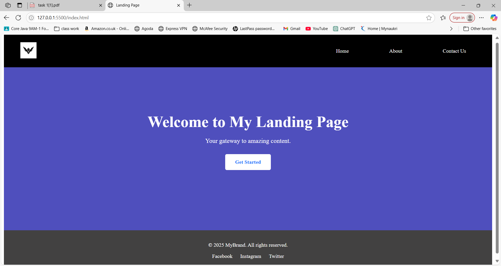

# My landing Page

A responsive and modern landing page built with **HTML5** and **CSS3**. This project features a clean layout with a header, hero section, and footer, and adapts to different screen sizes using media queries.

##  Features
- Responsive design with media queries
- Flexbox layout structure
- Clean and simple code
- Easy to customize

## Screenshot


##  How to Run Locally
1. Clone this repository:
```bash
https://github.com/akhilak5/Task1-Landing-page


